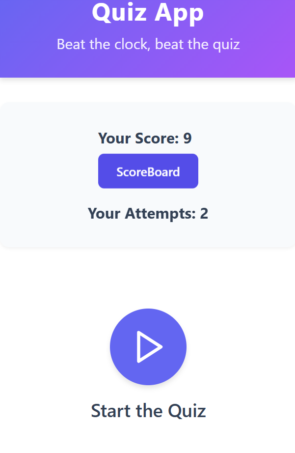
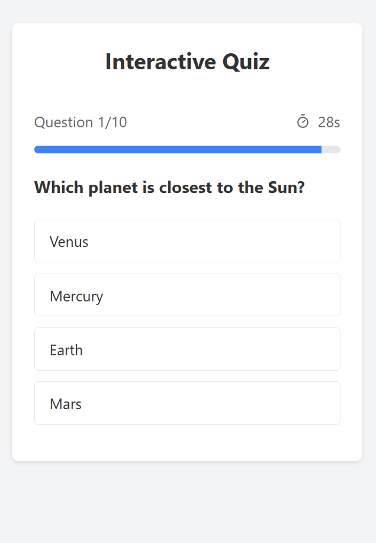
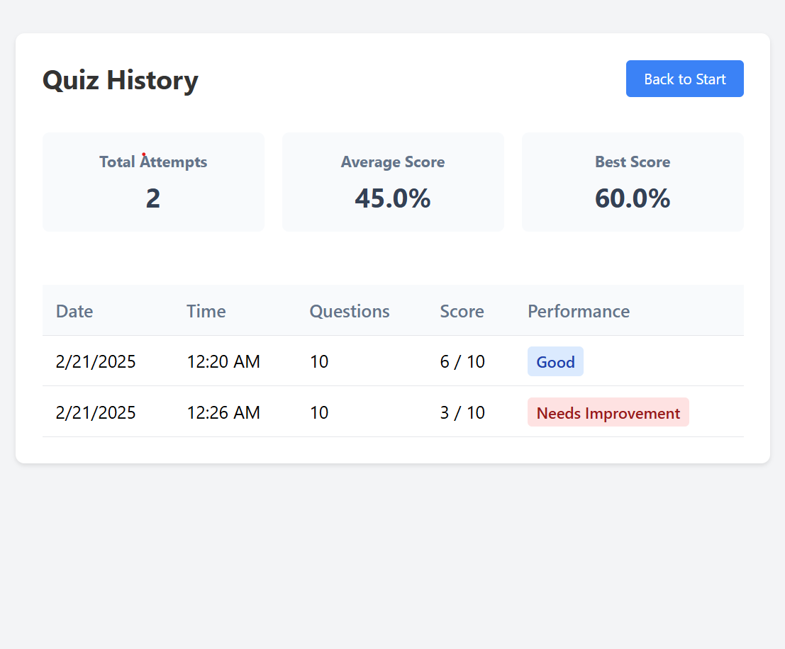

# 🎯 Quiz App 

A fun and interactive **Quiz Application** built with **React.js** and **IndexedDB**, allowing users to test their knowledge, track scores, and view quiz history. 🚀

## 📌 Features
- ✅ **Multiple Attempts:** Try the quiz as many times as you like.
- ✅ **Scoreboard:** Tracks previous attempts with **date & time**.
- ✅ **Performance Analysis:** Shows performance as **Excellent, Good, Average, or Needs Improvement**.
- ✅ **IndexedDB Storage:** Saves quiz history locally.
- ✅ **Leaderboard (Planned Feature):** Compete with others on a global scale!

## 🖼 Screenshots


"In Mobile View"

"Quiz Page"

"ScoreBorad"


## 🛠 Tech Stack
- ⚛️ **React.js** – UI Framework  
- 🎯 **IndexedDB** – Local Storage  
- 🎨 **CSS** – Styling  
- 🚀 **Vite** – Lightning-fast development  

## 🔧 Installation & Setup

### 1️⃣ Clone the Repository
```sh
git clone https://github.com/karthik-creation/quiz-app.git
cd quiz-app
```
### 2️⃣ Install Dependencies
```sh
npm install
```
### 3️⃣ Run the Development Server
```sh
npm run dev
```
Now, open http://localhost:5173/ in your browser. 🎉


### 4️⃣ Build for Production
```sh
npm run build
```

### 5️⃣ Preview Production Build
```sh
npm run preview
```

